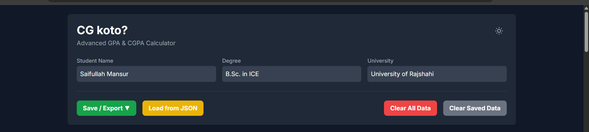
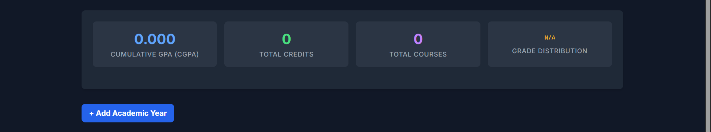
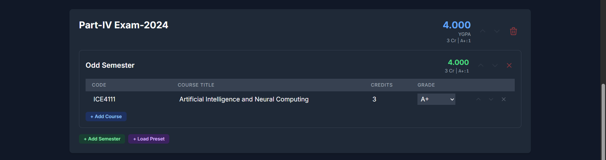
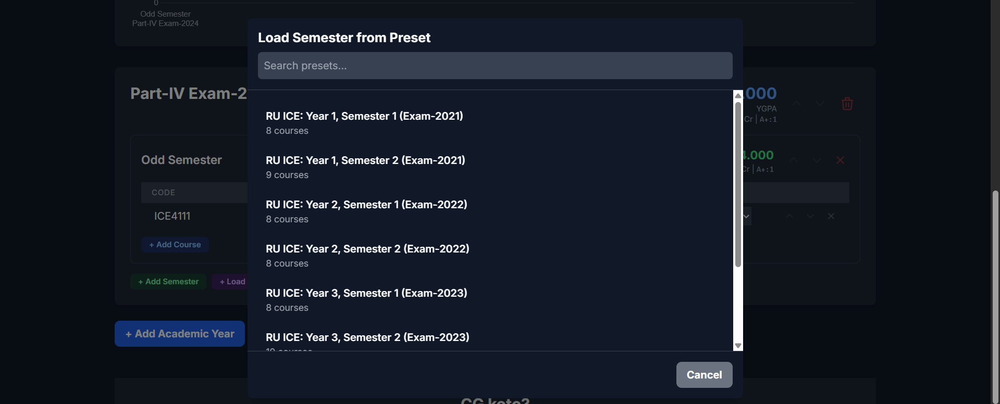
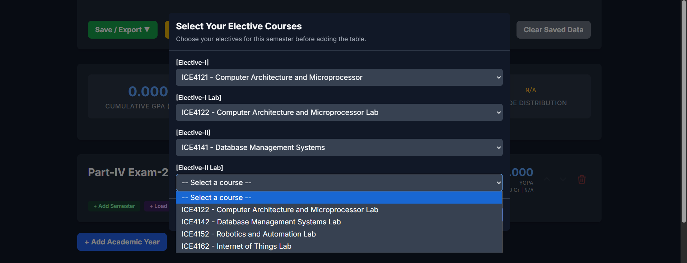
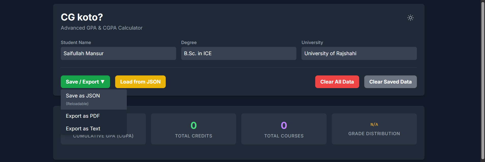
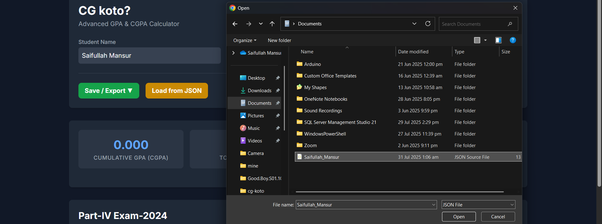
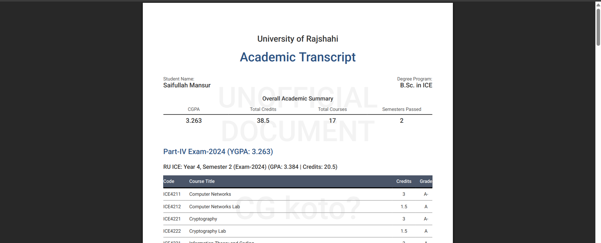
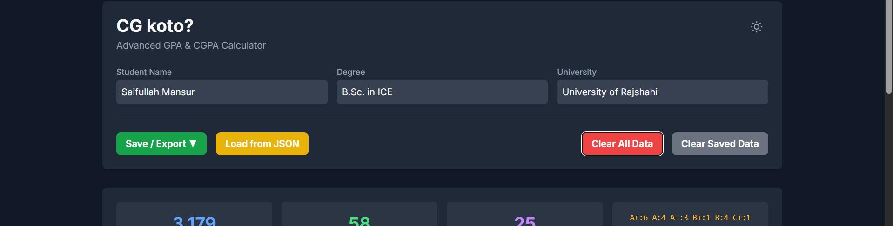

# CG Koto? - Advanced GPA & CGPA Calculator

**CG Koto?** is a powerful, user-friendly web application designed to help students accurately calculate, track, and manage their Grade Point Average (GPA) and Cumulative Grade Point Average (CGPA). With a clean interface, robust features, and professional PDF exporting, it's the ultimate tool for academic progress tracking.

**Live Link:** [saifullahmnsur-again.github.io/cg-koto/](https://saifullahmnsur-again.github.io/cg-koto/)

---

## ✨ Key Features

* **Dynamic Calculations**: Automatically calculates Semester GPA (GPA), Year GPA (YGPA), and Cumulative GPA (CGPA) in real-time as you enter your course data.
* **Auto-Saving**: Never lose your data. All entries are automatically saved to your browser's local storage.
* **Interactive GPA Trend Chart**: Visualize your academic journey with a dynamic line chart that tracks your GPA and CGPA progression over each semester.
* **Professional PDF Export**: Generate a beautiful, multi-page PDF summary of your academic transcript, complete with statistical analysis and your GPA trend chart.
* **Data Portability**: Save your complete academic record as a `.json` file and load it back into the app on any device, at any time.
* **Course Presets**: Quickly load predefined course structures for specific semesters to save time on data entry.
* **Responsive Design**: A clean, modern interface that works seamlessly on desktops, tablets, and mobile devices.
* **Light & Dark Mode**: Switch between themes for your viewing comfort.

---

## 🚀 Complete Tutorial

Here is a complete guide to using every feature of **CG Koto?**.

### **Part 1: Getting Started**

#### **1. Enter Your Personal Information**
Before you begin, fill in your details at the top of the page. This information will be used to personalize your exported PDF transcript.

#### **2. Add an Academic Year**
Your workspace is organized by academic years. Click the blue **+ Add Academic Year** button at the bottom of the page to create your first year section.

You can rename the year (e.g., to "First Year" or "2024-2025") by clicking directly on its title.

#### **3. Add a Semester**
Inside each year, you can add multiple semesters by clicking the green **+ Add Semester** button. You can also rename the semester by clicking its title.

---

### **Part 2: Adding and Managing Courses**

#### **1. Add Individual Courses**
Inside a semester table, click the **+ Add Course** button to add a new row. Fill in the **Code**, **Course Title**, **Credits**, and select the **Grade**. Your GPAs and stats will update instantly.

#### **2. Use a Preset Semester**
To save time, click the purple **+ Load Preset** button within a year. A modal window will appear where you can search for and select a predefined semester.

#### **3. Handle Elective Courses**
If a preset contains elective courses, a second modal will appear prompting you to select the specific elective courses you took from the dropdown menus.

---

### **Part 3: Managing and Exporting Your Data**

#### **1. Saving Your Data (JSON)**
Click the **Save / Export** dropdown and select **Save as JSON**. This downloads a `.json` file of all your data, which serves as your permanent backup.

#### **2. Loading Your Data (JSON)**
Click the **Load from JSON** button and select a `.json` file you previously saved. This will instantly restore your data in the app.

#### **3. Exporting Your Transcript (PDF & Text)**
Under the **Save / Export** dropdown, you have two options for your transcript:

* **Export as PDF**: This generates a professional, multi-page PDF of your academic record, including a visual chart and statistical summaries.
* **Export as Text**: This creates a simple, clean `.txt` file of your results.

#### **4. Clearing Data**
* **Clear All Data**: Removes all data from the current session.
* **Clear Saved Data**: Erases the auto-saved data from your browser's local storage for a fresh start.

---

## 🛠️ Built With

* **HTML5**
* **Tailwind CSS** for styling
* **Vanilla JavaScript** for all logic and interactivity
* **Chart.js** for the dynamic GPA trend chart
* **pdfmake.js** for professional client-side PDF generation

---

## 👤 Author

**Saifullah Mansur**
* **GitHub**: [@saifullahmnsur-again](https://github.com/saifullahmnsur-again)
* **X (Twitter)**: [@saifullahmnsur](https://x.com/saifullahmnsur)
* **LinkedIn**: [in/saifullahmnsur](https://linkedin.com/in/saifullahmnsur)